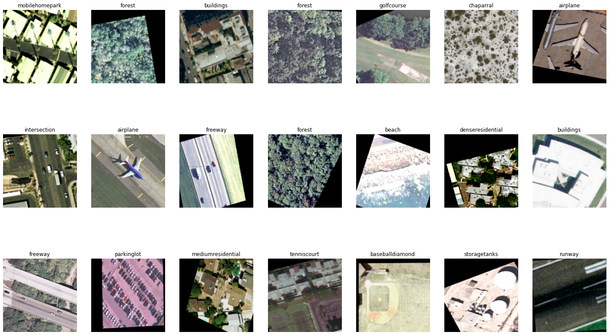
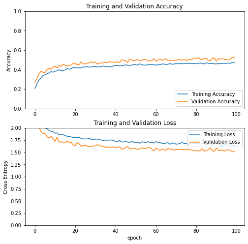

# Classifying Land Use via Satellite Images


Images of the Earth taken by satellites in orbit are a data source found in abundance all over the internet. Many governmental space agencies (such as NASA) even make their full catalog freely open and accessible to the public via the NASA Earth Observatory website (https://earthobservatory.nasa.gov). This provides an incredibly powerful way for a person located anywhere to obtain data about the conditions of any location on Earth at a particular point in time. This data has many obvious use cases, and some not so obvious.
- Identifying potential sites for resource extraction sites (mineral mining)
- High resolution satellite images are used by engineers in the planning of new projects, identifying potential geological roadblocks to new construction of buildings or infrastructure 
- Disaster relief mitigation: Quickly identifying hardest hit areas, assisting with assessment and prioritization of relief 
- State Defense: Monitoring strategic regions & facilities of hostile nations (ie. North Korean nuclear program)
- Assessing quantity and quality of arable land in use for agriculture  
- Estimating climate induced changes across a variety of geographical features (ie. ice melt, coastal land loss etc.)
- Targeting government poverty alleviation programs based on infrastructure and housing materials in images

Despite the abundance of data, satellite imagery remains a  difficult source to parse, as image quality and resolution can be affected by a variety of factors, the main culprit being weather. This makes the ability to classify landscape types, and objects within them a valuable and challenging asset for accomplishing any of the tasks listed above. 
	


## 1. The Data

The landscape images for this project come from the United States Geological Survey (USGS). USGS perform a number of different types of remote sensing data collections around the country, and makes their research publicly available. One of their projects is the “National Map Urban Area Imagery” collection of satellite images. This dataset contains 2100 images belonging to 21 different classes (100 images per class). 

[USGS Website](https://www.usgs.gov/products/data-and-tools/data-and-tools-topics)
#### Classes: 
- airplane
- baseballdiamond
- beach
- buildings
- chaparral
- denseresidential
- forest
- freeway
- golfcourse
- harbor
- intersection
- mediumresidential
- mobilehomepark
- overpass
- parkinglot
- river
- runway
- sparseresidential
- storagetanks
- tenniscourt



## 2. Image Augmentation

Additional data points were created by creating permutations of each image via random flips & rotations

[Augmented Images](augmentations.png)

## 3. Transfer Learning

Transfer learning is usually done for tasks where your dataset has too little data to train a full-scale model from scratch.

The most common incarnation of transfer learning in the context of deep learning is the following workflow:

Take layers from a previously trained model.
Freeze them, so as to avoid destroying any of the information they contain during future training rounds.
Add some new, trainable layers on top of the frozen layers. They will learn to turn the old features into predictions on a new dataset.
Train the new layers on your dataset.
A last, optional step, is fine-tuning, which consists of unfreezing the entire model you obtained above (or part of it), and re-training it on the new data with a very low learning rate. This can potentially achieve meaningful improvements, by incrementally adapting the pretrained features to the new data.

This project will make use of a pre-trained model named [Xception](https://keras.io/api/applications/xception/), a deep convolutional neural network architecture trained on 350 million images and 17,000 classes.


## 4. Building the Model

[Model Training Notebook](Land_Use_Classification_2_0.ipynb)

```
Model: "model"
_________________________________________________________________
Layer (type)                 Output Shape              Param #   
=================================================================
input_2 (InputLayer)         [(None, 150, 150, 3)]     0         
_________________________________________________________________
sequential (Sequential)      (None, 150, 150, 3)       0         
_________________________________________________________________
normalization (Normalization (None, 150, 150, 3)       7         
_________________________________________________________________
xception (Functional)        (None, 5, 5, 2048)        20861480  
_________________________________________________________________
global_average_pooling2d (Gl (None, 2048)              0         
_________________________________________________________________
dropout (Dropout)            (None, 2048)              0         
_________________________________________________________________
dense (Dense)                (None, 1024)              2098176   
_________________________________________________________________
dense_1 (Dense)              (None, 21)                21525     
=================================================================
Total params: 22,981,188
Trainable params: 2,119,701
Non-trainable params: 20,861,487
_________________________________________________________________
```

Training & Validation Accuracy/Loss during 1st round of training of new layers on top of frozen base layer.



## Flask App Predictions
[Flask App Repo](https://github.com/mtobeiyf/keras-flask-deploy-webapp)

Using a forked version of the repo linked below, a flask app was deployed to visualize the models predictions in real time. Instrusctions for downloading/deploying this model and app can be found [here](https://github.com/KevinmKrieg/satellite-image-classification/blob/main/flask_webapp/README.md)


